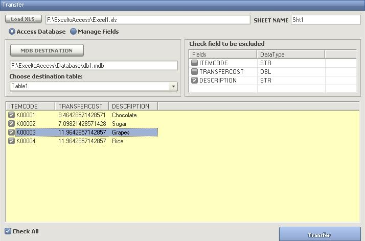



## Excel to Access

### Description

Transfer Excel Data To Access
 
### More Info
 

             |
---                |---
**Submitted On**   |2008-03-04 12:19:16
**By**             |[Jhenneson Torayno](https://github.com/Planet-Source-Code/PSCIndex/blob/master/ByAuthor/jhenneson-torayno.md)
**Level**          |Beginner
**User Rating**    |4.8 (29 globes from 6 users)
**Compatibility**  |VB 6\.0, VBA MS Access, VBA MS Excel
**Category**       |[Microsoft Office Apps/VBA](https://github.com/Planet-Source-Code/PSCIndex/blob/master/ByCategory/microsoft-office-apps-vba__1-42.md)
**World**          |[Visual Basic](https://github.com/Planet-Source-Code/PSCIndex/blob/master/ByWorld/visual-basic.md)
**Archive File**   |[Excel\_to\_A2105533102008\.zip](https://github.com/Planet-Source-Code/jhenneson-torayno-excel-to-access__1-70237/archive/master.zip)

